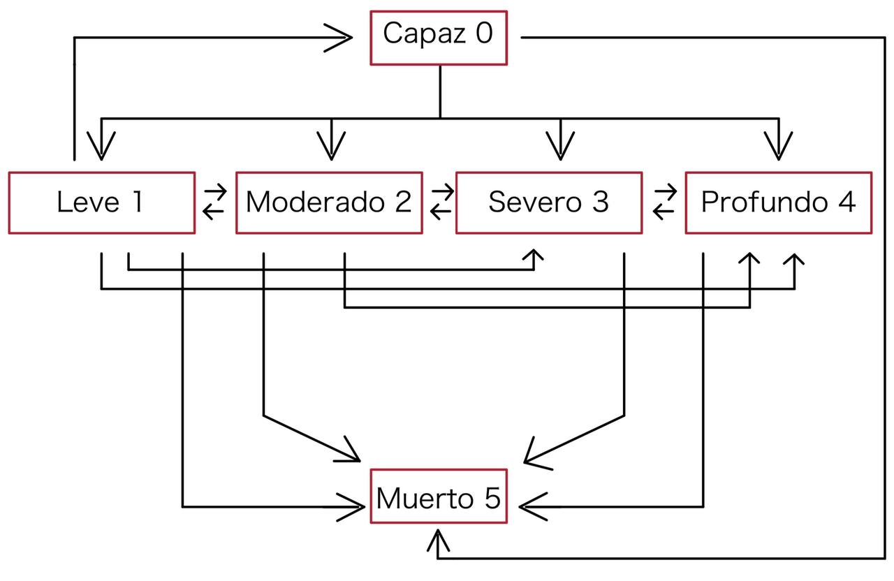

```{r setup, include=FALSE}
knitr::opts_chunk$set(echo = TRUE)
```
<style>
body {
text-align: justify}
</style>

<style>
p {
    font-size: 16px;
    line-height: 24px;
    margin: 0px 0px 12px 0px;
}

h1, h2, h3, h4, h5, h6, legend {
    font-family: Arial, sans-serif;
    font-weight: 700;
    color: #9F2042;
}
</style>
```{r, echo=FALSE, results='hide', message=FALSE}
# paquetes necesarios 
suppressWarnings({
 library(tidyverse)
 library(janitor)
 library(dplyr)
 library(ggplot2)
 library(plotly)
 library(readxl)
 library("papaja")
 library(kableExtra)
})
```
## Introducción

El presente trabajo tiene como objetivo presentar el diseño de un producto de cuidados de largo plazo para la población costarricense. El producto propuesto se llama **Longevidad Asegurada** y realiza pagos mensuales de forma vitalicia, dependiendo del estado de salud de la persona, siempre y cuando esta realice pagos de primas mensuales hasta los 65 años.

La propuesta actual se centra en ofrecer a los clientes un producto especializado que les brinde mayor seguridad de contar con ingresos mensuales en el futuro, proporcionándoles los recursos necesarios para hacer frente a gastos médicos, cirugías y cuidados en la etapa final de la vida, sin depender de apoyo financiero externo. Específicamente, el seguro de cuidados de largo plazo propuesto constituye una póliza para las personas con estados de salud delicados que requieren tratamiento y atención médica constante. Este seguro cubre los costos mensuales de enfermería domiciliaria para los cuidados paliativos como lo son: ayuda con la alimentación y el aseo, aplicación de inyecciones y medicamentos, tratamiento de heridas, entre otros requeridos.También, el seguro cubre los gastos mensuales de estancia en hogares de ancianos.


Debido a que este producto no se encuentra actualmente en el país, se utilizan como base para los cálculos los datos experimentales de probabilidad en el trabajo: "A multiple state model for pricing and reserving private long term care insurance contracts in Australia" [@leung2006multiple].

## Supuestos

Para poder crear un producto que sea rentable, se utilizaron herramientas de matemática actuarial y fue necesario tomar una serie de supuestos que se presentan a continuación:

1.  **Monto de los beneficios:** Para establecer el monto de los beneficios se toma en consideración el estado de salud en que se encuentre el asegurado al final del mes. Se dictaminan cuatro estados pagaderos de beneficios: leve, moderado, severo y profundo. El valor de los beneficios correspondientes a cada estado cubrirá un porcentaje de los gastos de cuidados, el cual es de 25%, 35%, 45%, 55% respectivamente. Por tanto, primeramente, es necesario definir el costo promedio mensual en Costa Rica de los servicios de atención de enfermería y la estancia en ascilos de ancianos. De acuerdo con [@ascilo], el costo promedio de cuido de un adulto en una residencia de largo plazo es aproximadamente de 431.136 colones mensuales. En cuanto a la asistencia de enfermería privada a domicilio, según [@enfemeria], el salario mínimo por servicios profesionales durante el segundo semestre 2019 de enfermería es de 809.463,15 colones mensuales. Considerando que trabajan seis días a la semana durante 8 horas el salario por hora es de 4215,953906 colones. Para el cálculo de los gastos por este servicio, se establece el supuesto de que el cuido es durante seis días de la semana en todo el mes y las horas de atención son de acuerdo con el estado de salud del asegurado. Si el estado es leve se considera una atención de tres horas. En caso de presentar un estado moderado, la atención es de seis horas. Para un asegurado con salud grave son doce horas y profunda son veinticuatro horas de atención. De tal manera, los costos mensuales corresponden a: 303.548,6812 colones, 607.097,3625 colones, 1.214.194,725 colones y 2.428.389,45 colones respectivamente. Por consiguiente, el costo total de los gastos por cuidados y valor de los beneficios que proporciona el seguro se muestran en la siguiente tabla:

```{r, results='asis',echo=FALSE}
tabla <- data.frame(
  estado = c("Leve", "Moderado", "Severo", "Profundo"),
  costo_total_gastos = c("734,684.6812", "1,038,233.363", "1,645,330.725", "2,859,525.45"),
  beneficios_mensuales = c("183,671.1703", "363,381.6771", "740,398.8263", "1,572,738.998")
)


tabla <- tabla %>%
  rename(
    "Estado de salud" = estado,
    "Costo total mensual de los gastos de cuido (en colones)" = costo_total_gastos,
    "Beneficios mensuales del seguro (en colones)"= beneficios_mensuales
  ) 

tabla_bonita <- tabla %>%
  kable(format = "html", align = "c") %>%
  kable_styling(full_width = FALSE) %>%
  row_spec(0, bold = TRUE, color = "white", background = "#9F2042" , align = "c") %>%
  row_spec(1:4, align = "r")

tabla_bonita
```    

2.  **Inflación:** Se considera un valor fijo de inflación de $2.88\%$. Este es un promedio de la inflación en Costa Rica en los últimos 10 años según datos de [@inflacion], alimentados por la base de datos del Fondo Monetario Internacional, Banco Mundial e indicador del IPC de la OCDE.

3.  **Tasa de descuento:** Se descargó la base de datos de la Curva de Rendimiento Soberana del Banco Central a tres meses y se decidió considerar un promedio de las tasas de los últimos seis meses, específicamente desde 03/05/2023 al 07/11/2023 [@descuento]. Por lo tanto, se considera una tasa de descuento del $5.8\%$ para realizar los cálculos respectivos.

4.  **Gastos:** Se consideran unos gastos inciales de 20% de la primera prima y 5% de las subsiguientes primas.

5.  **Población:** Se utilizaron estadísticas demográficas del 2023 basadas en proyecciones a partir del año 2018 como fuente de datos de la población costarricense [@poblacion]. Estas estadísticas proporcionan información sobre la cantidad de personas costarricenses vivas, desglosadas por género, en edades que varían desde 0 hasta 100 años. El producto que se presenta en este informe está dirigido específicamente a personas con edades comprendidas entre 30 y 65 años, ya que se considera que es menos atractivo para un público más joven. A partir de los 45 años, se espera que el interés en este seguro se distribuya de manera más uniforme. A continuación, se presenta dos cuadros con la información de la población considerada en el diseño de este producto para hombres y mujeres.

```{r, echo=FALSE, results='hide', message=FALSE}

#--- Abrir Base de Datos -------------------------------------------------------

# abrir datos demograficos

Hombres_2023_demografia <- read_excel("repoblacev2011-2050-05_2.xlsx", sheet = "Cuadro 5 ", range = "G1017:G1177")
Mujeres_2023_demografia <- read_excel("repoblacev2011-2050-05_2.xlsx", sheet = "Cuadro 5 ", range = "G1857:G2017")

colnames(Hombres_2023_demografia) <- c("pob_H")
colnames(Mujeres_2023_demografia) <- c("pob_M")

# filtrar los datos demograficos

filtro <- c()
for (i in 0:19){
  filtro <- c(filtro, (4+i*8):(8+i*8))
}

Hombres_2023_demografia <- Hombres_2023_demografia[filtro,1]
Mujeres_2023_demografia <- Mujeres_2023_demografia[filtro,1]

# abrir datos de probabilidades de transición

Prob_Trans_Hombres <- read.csv("ProbTransHombres.csv", sep = ";")
Prob_Trans_Mujeres <- read.csv("ProbTransMujeres.csv", sep = ";")

# ajustarlas para que sumen 1

for(fila in 1:nrow(Prob_Trans_Hombres)){
  for(col in 3:8){
    Prob_Trans_Hombres[fila,col] <- Prob_Trans_Hombres[fila,col]/sum(Prob_Trans_Hombres[fila,3:8])
    Prob_Trans_Mujeres[fila,col] <- Prob_Trans_Mujeres[fila,col]/sum(Prob_Trans_Mujeres[fila,3:8])
  }
}

#--- Población -----------------------------------------------------------------

edades <- 31:65

porcentajes <- c(0.05, 0.05, 0.08, 0.08, 0.10, 0.10, 0.15, 0.15, 0.20, 0.20, 0.25, 0.25, 0.30, 0.30, 0.35,
                 rep(0.6, 20))  # Luego, 20 porcentajes uniformes de 0.6

# Caso hombres 

# Crear un dataframe para las edades
edades_df <- data.frame(Edad = edades-1)
edades_selec_H <- Hombres_2023_demografia[edades,] 

# Unir el dataframe de edades con el dataframe de hombres
edades_selec_H <- cbind(edades_df, edades_selec_H)

# Luego puedes agregar este vector de porcentajes al dataframe edades_selec_H
edades_selec_H$porc_estimados <- porcentajes

# Calcular la población por edad (multiplicar la cantidad de hombres por el porcentaje)
edades_selec_H$pob_estimada<- edades_selec_H$pob_H* edades_selec_H$porc_estimados

# Caso Mujeres 
edades_selec_M <- Mujeres_2023_demografia[edades,] 
edades_selec_M <- cbind(edades_df, edades_selec_M)
edades_selec_M$porc_estimados <- porcentajes
edades_selec_M$pob_estimada<- edades_selec_M$pob_M * edades_selec_M$porc_estimados

p = ggplot() + 
  geom_line(data = edades_selec_H, aes(x = Edad, y = pob_estimada, color = "Hombres"), linetype = "solid", linewidth = 1) +
  geom_line(data = edades_selec_M, aes(x = Edad, y = pob_estimada, color = "Mujeres"), linetype = "solid", linewidth = 1) +
  scale_color_manual(values = c("Hombres" = "lightblue4", "Mujeres" = "#9F2042"), name = "Población") +
  xlab('Edad') +
  ylab('Población estimada') + cowplot::theme_cowplot()

edades_selec_H <- edades_selec_H %>%
  rename(
    "Población hombres" = pob_H,
    "Porcentaje estimados" = porc_estimados,
    "Población hombres estimada"= pob_estimada
  )


edades_selec_M <- edades_selec_M %>%
  rename(
    "Población mujeres" = pob_M,
    "Porcentaje estimados" = porc_estimados,
    "Población mujeres estimada"= pob_estimada
  )

tabla_html <- knitr::kable(edades_selec_M, format = "html")

tabla_html <- edades_selec_M %>%
  kable(format = "html", escape = FALSE) %>%
  kable_styling(bootstrap_options = c("striped", "hover"), full_width = FALSE) %>%
  row_spec(0, bold = TRUE, color = "white", background = "#9F2042", align = "c") %>%
  column_spec(1, width = "100x") %>%
  column_spec(2, width = "150px") %>%
  column_spec(3, width = "150px")


tabla_html_hombres <- knitr::kable(edades_selec_H, format = "html")

tabla_html_hombres <- edades_selec_H %>%
  kable(format = "html", escape = FALSE) %>%
  kable_styling(bootstrap_options = c("striped", "hover"), full_width = FALSE) %>%
  row_spec(0, bold = TRUE, color = "white", background = "#9F2042", align = "c") %>%
  column_spec(1, width = "100x") %>%
  column_spec(2, width = "150px") %>%
  column_spec(3, width = "150px")

#--- Inflación e Interés --------------------------------------------------------

# inflación en Costa Rica de los últimos 10 años según Base de datos del Fondo Monetario Internacional, Banco Mundial e indicador del IPC de la OCDE
inflacion_data <- data.frame(
  Ano = c(2012, 2013, 2014, 2015, 2016, 2017, 2018, 2019, 2020, 2021, 2022),
  Costa_Rica = c(4.50, 5.23, 4.52, 0.80, -0.02, 1.63, 2.22, 2.10, 0.72, 1.73, 8.27)
)

inflacion <- mean(inflacion_data$Costa_Rica) 
# inflación = 2.8818


# descargamos la curva de rendimiento soberana de los últimos 6 meses
tasas_Descuento <- read_excel("descuento.xlsx") 

descuento <- mean(tasas_Descuento$`3 meses`)
# descuento 5.8


# Agregar un título al gráfico
p <- p + ggtitle("Población estimada para Longevidad Asegurada")

# Agregar el número de gráfico
p <- p + labs(
  caption = "Figura 1: Población esperada por edades (Hombres y Mujeres)\nFuente: Elaboración propia con datos del INEC"
)


```


```{r, results='asis',echo=FALSE}

cat('<div style="text-align: center;">')
cat('<button onclick="var x = document.getElementById(\'tabla_hombres\'); if (x.style.display === \'none\') { x.style.display = \'block\'; } else { x.style.display = \'none\'; }">Mostrar u ocultar cuadro hombres</button>')

cat('<div id="tabla_hombres" style="display: none;">')
cat(tabla_html_hombres)
cat('</div>')
cat('<button onclick="var x = document.getElementById(', "'tabla_mujeres'", '); if (x.style.display === ', "'none'", ') { x.style.display = ', "'block'", '; } else { x.style.display = ', "'none'", '; }"> Mostrar u ocultar cuadro mujeres</button>')

cat('<div id="tabla_mujeres" style="display: none;">')
cat(tabla_html)
cat('</div>')
cat('</div>')


```

Por su parte, en el siguiente gráfico se evidencia más la construcción de la población estimada para el producto. 

```{r, echo=FALSE, results='hide', message=FALSE}
print(p)
```

## Diseño del producto 

Siguiendo la base del trabajo de @leung2006multiple, el modelo debe de considerar los siguientes cinco estados: 

```{r, results='asis',echo=FALSE}
# Crear la tabla
tabla <- data.frame(
  "Estado" = 0:5,
  "Nombre" = c("capaz", "leve", "moderado", "severo", "profundo", "muerto"),
  trans. = c("1, 2, 3, 4, 5", "0, 2, 3, 4, 5", "1, 3, 4, 5", "2, 4, 5", "3, 5", "ninguno")
)

tabla <- tabla %>%
  rename("Transiciona a estados" = trans.)

# Formatear la tabla
tabla_bonita <- tabla %>%
  kable(format = "html", escape = FALSE) %>%
  kable_styling(bootstrap_options = c("striped", "hover"), full_width = FALSE) %>%
  row_spec(0, bold = TRUE, color = "white", background = "#9F2042", align = "c") %>%
  row_spec(1:6, align = "l") %>%  
  column_spec(1, width = "100px") %>%
  column_spec(2, width = "100px") %>%
  column_spec(3, width = "150px")

# Imprimir la tabla
tabla_bonita
```

Si una persona que compra el seguro **Longevidad Asegurada**, que actualmente se encuentra en el estado de leve (1), dentro de un período futuro t, su estado de salud puede permanecer igual o cambiar a uno de los siguientes estados: capaz (0), moderado (2), severo (3), profundo (4) o muerto (5). Sin embargo, para una persona que hoy se encuentra en el estado profundo, en cualquier momento en el futuro, su estado de salud puede permanecer sin cambios, o puede cambiar a los estados severo (3) o muerto (5).

Para un mayor entendimiento, se presenta el siguiente gráfico de múltiples estados: 


```{r, fig.cap="Figura 2: Modelo de múltiples estados\nFuente: Elaboración propia basado en Leung (2006)."}


```

En este gráfico, cada una de las flechas simboliza que existe probabilidad positiva ( > 0 ) de pasar de un estado "i" a un estado "j".


Lo primero que se realizó fue la creación de la tabla de probabilidades de transición para la población masculina y femenina. Esto implica conocer la probabilidad de transición de un estado "i" a un estado "j", que puede ser el mismo, para cada edad. Si desea ver cómo se realizó lo anterior, puede acceder a la visualización presionando el botón correspondiente. Además, se presenta la función que permite obtener las probabilidades de transición a un año de un estado "i" a un estado "j", para cada edad.

```{r, eval=TRUE, message=FALSE}

##--- Creación de Dataframe con datos actuariales ------------------------------

# Esta función crea un dataframe con la proyección de personas (1 persona) en 
# ciertos estados a ciertas edades partiendo de una edad base, estado y un sexo

obtencion_tabla_proyeccion <- function(x,status,sexo) {
  if (sexo == "H"){
    probabilidades <- Prob_Trans_Hombres
  }
  if (sexo == "M"){
    probabilidades <- Prob_Trans_Mujeres
  }
  
  tabla <- data.frame(
    "edad" = x:111,
    "l_age.x_sta.0" = rep(0, 112-x),
    "l_age.x_sta.1" = rep(0, 112-x),
    "l_age.x_sta.2" = rep(0, 112-x),
    "l_age.x_sta.3" = rep(0, 112-x),
    "l_age.x_sta.4" = rep(0, 112-x),
    "l_age.x_sta.5" = rep(0, 112-x)
  )
  tabla[1,status+2] = 1
  
  c(10000, rep(0, 111-x))
  
  
  for (fila in 2:nrow(tabla)){
    for (col in 2:7){
      tabla[fila,col] <- 
        tabla[fila-1,2]*probabilidades[(fila+x-21),col+1] + 
        tabla[fila-1,3]*probabilidades[(fila+x-21)+91,col+1] + 
        tabla[fila-1,4]*probabilidades[(fila+x-21)+182,col+1] + 
        tabla[fila-1,5]*probabilidades[(fila+x-21)+273,col+1] + 
        tabla[fila-1,6]*probabilidades[(fila+x-21)+364,col+1] + 
        tabla[fila-1,7]*probabilidades[(fila+x-21)+455,col+1]
    }
  }
  return (tabla)
}

##--- Funciones actuariales ----------------------------------------------------

# Función de probabilidad
tPx_ij <- function(t=1,x=65,i=0,j=0,sexo){
  p <- obtencion_tabla_proyeccion(x,i,sexo)[t+1,j+2]
  return(p)
}

```
### Propuesta #1

La primera propuesta considera un producto en el cual el cálculo de la prima es el mismo para todas las personas, sin importar su edad, la edad en la que adquieren el producto, su estado de salud o su sexo.

El producto va a pagar montos de anualidad diferentes dependiendo del estado en el que se encuentre la persona. 


## Bibliografía

\bibliography{bibliografia_contingencias.bib}


